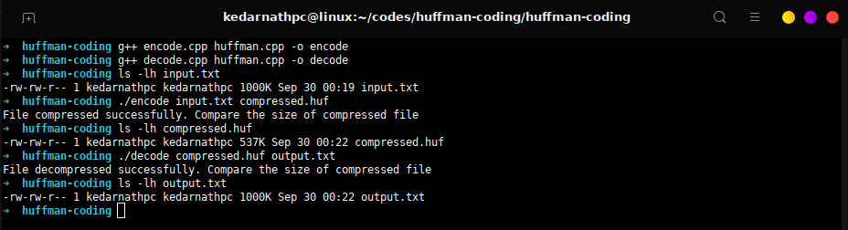
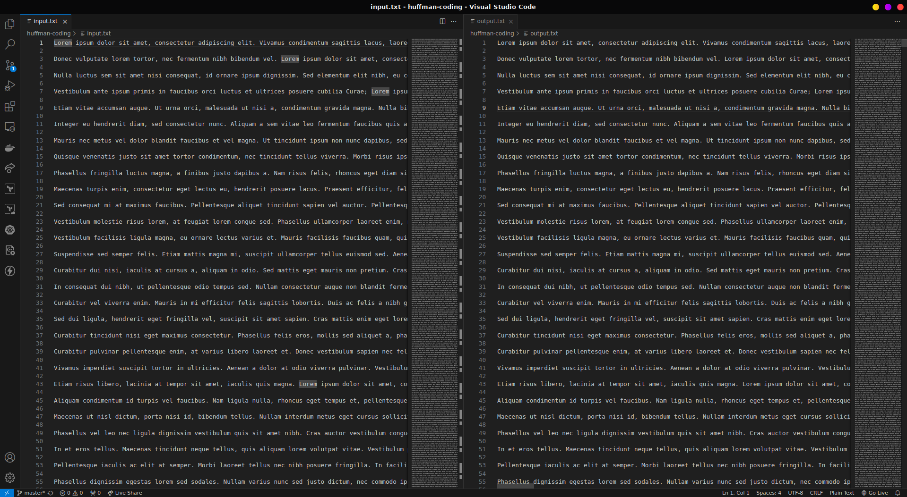

# Huffman Compression and Decompression

This project implements Huffman encoding and decoding in C++. It is Lossless compression technique used for reducing the size of data or message. The Huffman algorithm is used to compress files by encoding characters based on their frequency in the input file. This compression reduces the overall file size by assigning shorter codes to more frequent characters.

## How Huffman Algorithm Works
1. Frequency Analysis: The algorithm starts by reading the input file and calculating the frequency of each character.
2. Huffman Tree Creation: Based on the frequency of each character, a binary tree (Huffman Tree) is created using a priority queue. Characters with higher frequencies are placed higher in the tree, resulting in shorter binary codes for them.
3. Encoding: Using the Huffman Tree, each character is replaced by its corresponding binary code. The encoded data and the structure of the Huffman Tree are stored in the output file.
4. Decoding: The encoded file can be decoded using the metadata stored in the file (Huffman Tree and encoded binary data).

## Project Structure

```plaintext
.
├── decode.cpp     # File to decode a compressed file
├── encode.cpp     # File to encode the input file
├── huffman.cpp    # Core logic for Huffman compression and decompression
├── huffman.hpp    # Header file containing class and function declarations
├── input.txt      # Sample input file for testing
├── README.md      # Documentation of the project

```
# Setup

To set up and run the project locally:

1. Clone the repository:
```
git clone https://github.com/kedarnathpc/huffman-coding.git
```

2. Navigate into the project directory:
```
cd huffman-coding
```

3. Compile the project:
```
g++ -o encode encode.cpp huffman.cpp
g++ -o decode decode.cpp huffman.cpp
```
# Usage

### Encoding a file
To compress a file using Huffman encoding:
```
./encode input.txt compressed.huf
```
This command reads the input.txt file, compresses it using Huffman encoding, and stores the compressed data in compressed.huf.

### Decoding a file
To decompress a file back to its original form:
```
./decode compressed.huf output.txt
```
This command reads the compressed.huf file, decodes it, and saves the decompressed data in output.txt.

# Project Screenshots

## Terminal


## Input and Output
